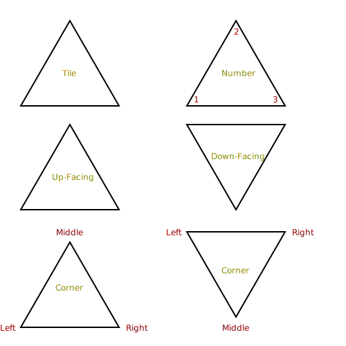
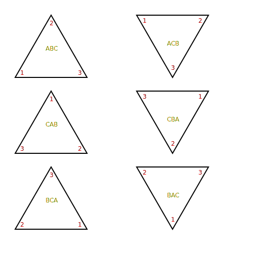
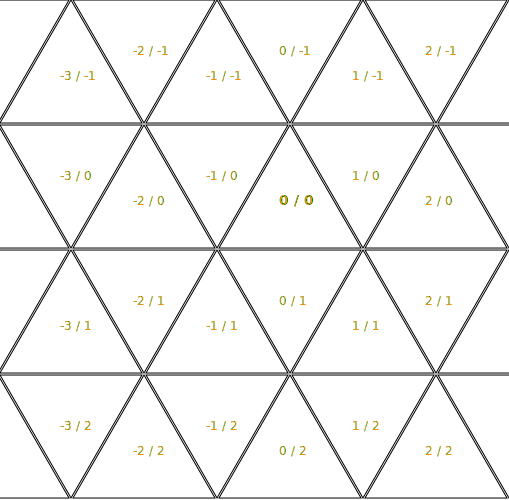
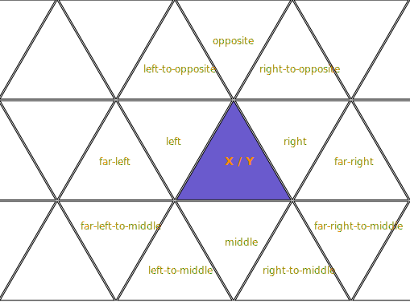
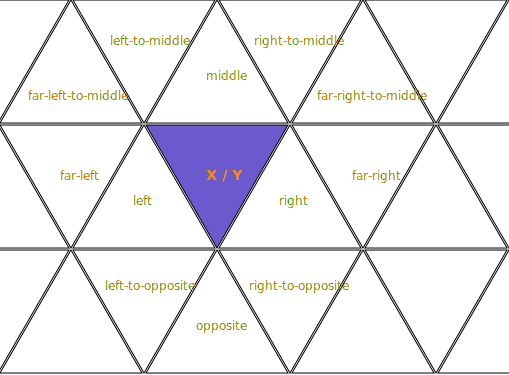

# Purpose of this project
*Note: Triominos is a game marketed and sold by Pressman Toy Corporation.
In no way does this project intend to take away any rights that Pressman has regarding the trademark Triominos.*

The purpose of this project is to experiment with:
* how to implement game play for Triominos with Java (applying TDD and Clean Code practices as much as possible)
* how different drawing and placement strategies can optimize for likelihood of victory by using AI for automated gameplay

# Rules
There exist several variants of the game.
One rule-set can be found [here](https://www.pressmantoy.com/wp-content/uploads/2018/01/Tri-Ominos.pdf).

# Terminology

## Tile, Number, Up-Facing, Down-Facing, Corner
A **tile** is a triangular piece and it is the core element of the game. 
It (obviously) has three **corner**s, where each corner has an assigned **number** in the range **0-5**.
Depending on the tile orientation (see next section), it is either **up-facing** or **down-facing**.
Corners are referred to as **left**, **middle**, and **right** as depicted in the graphic below.
When referring to a corner, this nomenclature is more useful than using the classic naming of corners with *A, B, C*, because it is independent of the orientation of a tile. 

## Rotation, Orientation
The **orientation** of a tile can be changed by **rotating** it.
There are six orientations: **ABC, ACB, CAB, CBA, BCA, BAC**.

The naming with letters *A, B, C* originates from the classical naming of triangle corners. 
Here, we chose to use the letters *A, B, C* instead of *left, middle, right*, because it aids understanding how the numbers change with each rotation.

For instance, the base orientation of the tile "1-2-3" is *ABC*. 
I.e., the left corner is "1", the middle corner is "2", and the right corner is "3".
After rotating the tile clockwise, it is in orientation "ACB". 
Now, the left corner is "1", the middle corner is "3", and the right corner is "2".

All orientations for the tile "1-2-3" are depicted below:

## Coordinate System, Location
We employ a 2D **coordinate system** to be able to specify where to place a tile on the game board.
Its center is defined at the **location** *(0, 0)*. 
Per definition, only an up-facing tile can be placed at the center location.
Whether a tile must be placed up- or down-facing at a location logically results from this requirement.
See the following graphic to understand how the game board could look like with the underlying coordinate system.

Note: in order to restrict the size of the game board, the first tile must be placed at *(0,0)* for an up-facing tile and at *(1,0)* for a down-facing tile.

  
## Placement
A **placement** describes in which *orientation* a given *tile* is to be placed at a given *location*.

For instance a placement {"1-2-3", *ACB*, *(-2,1)*}, places a tile "1-2-3" in orientation *ACB* at location (-2/1).

## Score
When a player successfully places a tile on the board, a **score** is calculated for the placement.
The following scoring rules apply:
- for a normal placement, the score is the sum of the corner numbers of the placed tile. 
  E.g., placing a tile "1-2-3" results in a score of *6*.
- for a placement that completes a hexagon, 50 points are credited in addition.
- for a placement that completes a two hexagons, 60 points are credited in addition.
- for a placement that completes a three hexagons, 70 points are credited in addition.
- for a placement that completes a bridge, 40 points are credited in addition.

## Neighbors
Checking the validity of a placement or calculating its resulting score is a non-trivial task.
Therefore, the following neighbor names are defined to simplify referencing a neighboring location:
**left, right, middle, opposite, far-left, far-right, left-to-opposite, right-to-opposite, left-to-middle, far-left-to-middle, right-to-middle, far-right-to-middle**.
The following graphics depict, which name is referring to which neighbor (for both, up-facing and down-facing tiles).

# Checking for valid placements

A placement is valid if:
- the tile orientation and location are facing in the same direction 
- it is the first placement and the location is either *(0/0)* or *(1/0)*
- no other tile has been placed at the location yet
- the same tile has not been played yet
- it has at least one existing **adjacent placement**, i.e. a tile is already placed at its left, middle, or right neighbor location
- for each existing adjacent placement, the edges match accordingly

# Calculating the score

## Detecting one or more completed hexagons
A placement completes a hexagon if placements for all five neighbor locations around any of its corners exist already.
That is:
- for the left corner, placements must exist for the neighbors *left, far-left, far-left-to-middle, left-to-middle, middle*. 
- for the middle corner, placements must exist for the neighbors *left, right, left-to-opposite, opposite, right-to-opposite*.
- for the right corner, placements must exist for the neighbors *right, far-right, far-right-to-middle, right-to-middle, middle*.

This reasoning can be easily understood by looking at the graphic in the [Neighbors](#neighbors) section.

To detect a placement that completes multiple hexagons, simply check if hexagons are completed at multiple corners.

## Detecting a completed bridge
A placements completes a bridge, if the corner opposite to an adjacent placement has one or more **non-adjacent placement**s. That is:
    - for an adjacent left neighbor, placements for any of the neighbors *far-left, far-left-to-middle, left-to-middle* must exist exist.  
    - for an adjacent middle neighbor, placements for any of the neighbors *opposite, left-to-opposite, right-to-opposite* must exist exist.  
    - for an adjacent right neighbor, placements for any of the neighbors *far-right, far-right-to-middle, right-to-middle* must exist exist.  

# Related work: 
https://github.com/AgileBitFlipper/triominos
